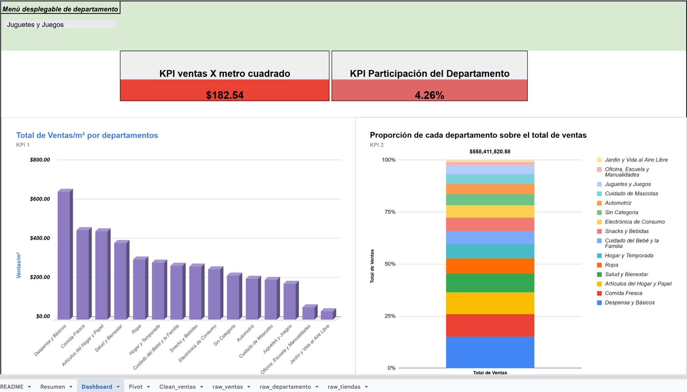

## 📂 Project Files

**Main project workbook**

➡️ ****

# Walmart Business Dashboard

Business Intelligence dashboard developed in Microsoft Excel to analyze Walmart's 2012 sales performance through data cleaning, KPI creation, Pivot Tables, and interactive visualizations.

## Business Objective

The objective of this project was to help Walmart's commercial team evaluate sales performance by answering two key business questions:

- Which departments generated the highest sales efficiency?
- Which departments contributed the most to total company sales?

## Tools Used

- Microsoft Excel
- Pivot Tables
- Dashboard Design
- Data Cleaning
- KPI Analysis
- Lookup Tables

## KPIs

- Sales per Square Meter
- Department Sales Participation

## Dashboard Preview

## Key Findings

- Built an interactive dashboard with department filters.
- Calculated business KPIs to measure efficiency and participation.
- Combined multiple datasets into a single analytical source.
- Applied the Context → Finding → Implication (CFI) framework to communicate business insights.
